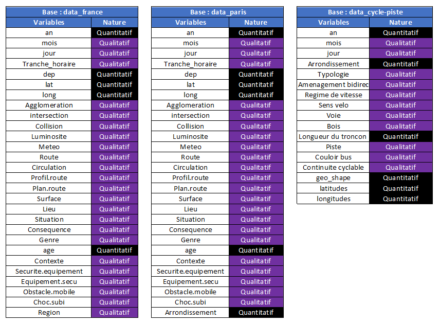
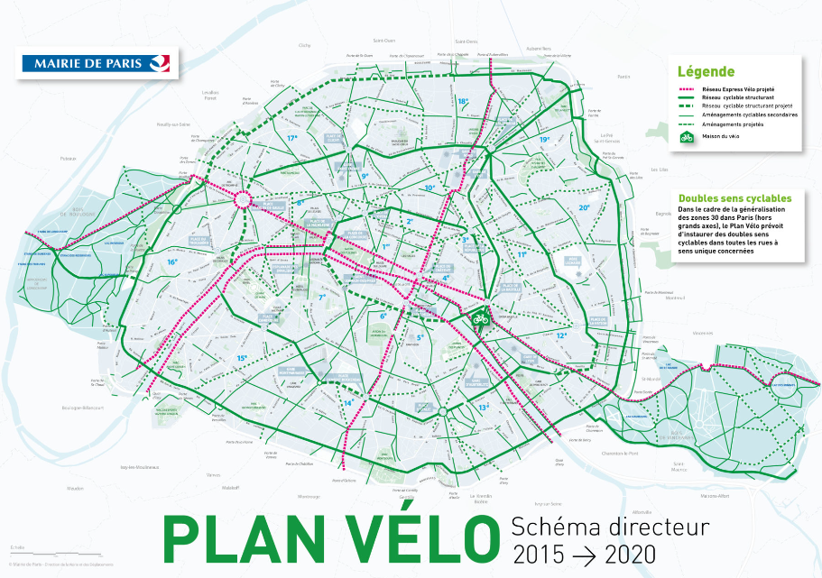

```{r setup, include=FALSE}
knitr::opts_chunk$set(fig.pos = "H", out.width = "90%", fig.align = "center")

###### Charger les différentes librairies 

library(installr)
library(lmtest)
library(tidyverse)
library(data.table)
library(magrittr)
library(DAAG)
library(plotly)
library(tseries)
library(olsrr) 
library(car)
library(readr)
library(readxl)
library(dplyr)
library(FactoMineR)
library(factoextra)
library(openxlsx)
library(Factoshiny)
library(gridExtra)
library(cowplot)
library(stringr)
```

# Introduction

## Contexte de l'étude

Le vélo est devenu un mode de transport de plus en plus populaire à travers le monde, offrant une alternative écologique et saine aux moyens de déplacement traditionnel. En France, la promotion de l'intérêt de l'utilisation du vélo est devenue une priorité, avec des efforts déployés pour créer des infrastructures adaptées, telles que des pistes cyclables, afin de favoriser la sécurité des cyclistes et encourager la pratique du vélo.

Cependant, malgré ces initiatives, la sécurité des cyclistes sur les routes reste une préoccupation majeure. Les accidents de vélos peuvent avoir des conséquences graves, mettant en lumière la nécessité d'une compréhension approfondie des facteurs contribuant à ces incidents. Dans ce contexte, l'analyse de données offre une approche précieuse pour examiner les tendances, les corrélations et les déterminants des accidents de vélos en France.

Cette analyse s'appuiera sur deux jeux de données différents. D'une part, une base de données détaillant les accidents de vélos survenus à travers le pays fournira des informations précieuses sur les circonstances, la gravité et les lieux des incidents. D'autre part, une base de données spécifique à Paris, décrivant la création et l'emplacement des pistes cyclables, permettra d'explorer la corrélation entre l'infrastructure dédiée aux cyclistes et la fréquence des accidents.

L'objectif de cette analyse est de dégager des tendances significatives, de mettre en évidence les zones à risque élevées, et d'évaluer l'impact des pistes cyclables sur la sécurité des cyclistes. En comprenant les facteurs sous-jacents aux accidents de vélos, il devient possible d'orienter les politiques publiques, d'améliorer les infrastructures et de promouvoir des mesures préventives pour garantir une cohabitation sûre et efficace entre les cyclistes et les autres usagers de la route.

Cette étude contribuera ainsi à la promotion d'une mobilité durable, en mettant en lumière les défis actuels et en proposant des solutions basées sur des données probantes pour renforcer la sécurité des cyclistes en France.

## Données

Les jeux de données comprennent une couverture complète des accidents de vélo à l'échelle nationale en France disponibles sur le site **data gouv**[^1], offrant une vue d'ensemble des incidents survenus dans tout le pays. Un second jeu de données se concentre spécifiquement sur les pistes cyclables provenant du site **data Paris**[^2], cartographiant l'infrastructure dédiée dans diverses localités. Enfin, un troisième jeu de données se focalise sur les accidents de vélo à Paris (filtré de notre première base de données avec rajout des arrondissements). Ces ensembles de données permettent d'analyser les tendances, de localiser les zones à risques et d'évaluer l'impact des pistes cyclables sur la sécurité, offrant ainsi une compréhension approfondie de la situation des cyclistes en France.

[^1]: <https://www.data.gouv.fr/fr/datasets/accidents-de-velo/#/resources>

[^2]: <https://opendata.paris.fr/explore/dataset/reseau-cyclable/information>

## Plan de l'étude

Notre première étape consistera à dégager les tendances des accidents de vélos et à localiser les zones à risques élevées à l'échelle nationale.

La deuxième phase de notre étude se concentrera sur l'analyse de la base de données détaillant les pistes cyclables à Paris. Cette démarche vise à cartographier ces infrastructures et à examiner leur évolution au fil du temps. Comprendre ces dynamiques est essentiel pour évaluer l'influence de l'infrastructure sur la sécurité des cyclistes.

Enfin, nous terminerons par regarder les données d'accidents par arrondissement de Paris permettant ainsi de cerner les défis spécifiques rencontrés dans la capitale. Cette approche nous permettra de déterminer les liens entre les accidents de vélos et l'existence de pistes cyclables. L'objectif ultime est d'identifier des zones spécifiques nécessitant des améliorations ciblées afin de renforcer la sécurité des cyclistes dans la ville de Paris.

# Analyse 

## Les accidents de vélos à l'échelle nationale

Au-delà des chiffres et des statistiques, une exploration visuelle des données sur les accidents de vélos offre des perspectives riches et nuancées. Le graphique ci-dessous, fruit d'une lecture attentive des informations recueillies sur une période de 13 ans, se présente comme une fenêtre captivante sur les schémas temporels de ces incidents. En se plongeant dans les nuances des mois et des jours de la semaine, ce graphique met en évidence des tendances saisissantes, confirmant ainsi nos premières observations. Découvrons ensemble la corrélation entre les saisons, les moments de la journée et la fréquence des accidents, éléments clés pour une compréhension approfondie des dynamiques complexes entourant la sécurité des cyclistes sur nos routes.

```{r accfrancedetail, fig.cap="Représentation des accidents de vélo en France par année, mois, jour et horaire / Lecture graphique : Les accidents de vélos se déroulent principalement en jours de semaine durant les après-midis lors des mois à température douce voir chaude, tel que le mois de juin qui représente un pic des accidents de vélos sur 13 ans / Source : Léo GABET RStudio", echo=FALSE, warning=FALSE}
################## Analyses univariées #################################

data <- read.csv("C:/Users/33662/Desktop/add_velo/data/data_clean.csv", sep=",", header = TRUE)

data <- data %>%
  mutate(dep = as.numeric(dep))
data <- data %>%
  mutate(long = as.numeric(long))

plot1 <- ggplot(data, aes(x = an, fill = Consequence)) +
  geom_histogram(breaks = seq(min(data$an), max(data$an)), 
                 width = 2, color = "black", alpha = 0.7) +
  geom_density(alpha = 0.2) +
  labs(title = "Accidents par an") +
  ylab("Nb accidents") +
  theme_minimal() +
  scale_fill_manual(values = c("orange", "skyblue", "green", "red")) + 
  theme(legend.position = "none") 


# Créer un facteur ordonné avec les niveaux des mois
data$mois <- factor(data$mois, levels = c("janvier", "fevrier", "mars", "avril", "mai", "juin", "juillet", "aout", "septembre", "octobre", "novembre", "decembre"))
plot2 <- ggplot(data, aes(x = mois, fill = Consequence)) +
  geom_bar(color = "black") +
  labs(title = "Accidents par mois") +
  ylab("Nb accidents") +
  theme_minimal() +
  scale_x_discrete(breaks = c("janvier", "avril", "aout", "decembre")) +
  scale_fill_manual(values = c("orange", "skyblue", "green", "red")) +
  theme(legend.position = "none")


# Créer un facteur ordonné avec les niveaux des jours
data$jour <- factor(data$jour, levels = c("lundi", "mardi", "mercredi", "jeudi", "vendredi", "samedi", "dimanche"))
plot3 <- ggplot(data, aes(x = jour, fill = Consequence)) +
  geom_bar(color = "black") +
  labs(title = "Accidents par jour") +
  ylab("Nb accidents") +
  theme_minimal() +
  scale_x_discrete(breaks = c("lundi", "mercredi", "vendredi", "dimanche")) +
  scale_fill_manual(values = c("orange", "skyblue", "green", "red")) + 
  theme(legend.position = "none")  


# Créer un facteur ordonné avec les niveaux les heures
data$Tranche_horaire <- factor(data$Tranche_horaire, levels = c("Matin", "Apres-midi", "Soir", "Nuit", "NA"))
filtered_data <- data[!is.na(data$Tranche_horaire), ]
# Créer le graphique avec les données filtrées
plot4 <- ggplot(filtered_data, aes(x = Tranche_horaire, fill = Consequence)) +
  geom_bar(color = "black") +
  ylab("Nb accidents") +
  labs(title = "Accidents par tranche horaire") +
  theme_minimal() +
  scale_fill_manual(values = c("orange", "skyblue", "green", "red")) + 
  theme(legend.position = "bottom") +
  guides(fill = guide_legend(title = "Conséquence"))

arranged_plots <- arrangeGrob(plot1 + theme(legend.position = "none"),
                              plot2 + theme(legend.position = "none"),
                              plot3 + theme(legend.position = "none"),
                              plot4 + theme(legend.position = "none"),
                              ncol = 2)

# Ajouter une légende en bas
legend <- cowplot::get_legend(plot4)

# Afficher le graphique final avec la légende en bas
gridExtra::grid.arrange(arranged_plots, legend, ncol = 1,
                        heights = c(15, 1))
```

Au regard des données, plusieurs hypothèses émergent pour expliquer les schémas observés dans les accidents de vélo. L'augmentation des incidents pendant les mois chauds suggère une affluence plus importante de cyclistes par temps agréable. La concentration d'accidents en juin pourrait résulter de la fin de l'année scolaire, incitant potentiellement les jeunes à être plus actifs à vélo. Les après-midis se distinguent par une fréquence élevée d'incidents, probablement liée à la routine quotidienne et aux déplacements après le travail ou l'école. Les conditions de visibilité réduite en après-midi pourraient également contribuer à l'augmentation des accidents. De plus, les variations saisonnières et les moments de la journée semblent influencer les comportements des cyclistes, impactant ainsi le nombre d'accidents. De plus, il y a une forte diminution des accidents en 2018 (tout comme en 2006) montrant l'intérêt des campagnes de préventions. Ces hypothèses fournissent une première approche pour interpréter les tendances, mais des analyses plus approfondies sont nécessaires pour confirmer ces impressions préliminaires.

### Identification des zones à risques élevés à l'échelle du pays

```{r accfranceregion, fig.cap="Accidents en France en fonction des régions / Lecture graphique : Une grande partie des accidents de vélo en France se déroule principalement en île de France, avec un très faible taux d'accident en Normandie / Source : Léo GABET RStudio", echo=FALSE, warning=FALSE}
ggplot(data, aes(x = Region, fill = Consequence)) +
  geom_bar(stat = "count", color = "black") +
  coord_flip() +  # Cela inverse les axes, rendant le graphique horizontal
  xlab("Régions") + 
  ylab("Nb accidents") +
  theme_minimal() +
  scale_fill_manual(values = c("orange", "skyblue", "green", "red")) + 
  theme(legend.position = "bottom", legend.key.size = unit(0.4, "cm")) +
  guides(fill = guide_legend(title = "Conséquence"))
```

La carte des accidents de vélo met en lumière une disparité significative entre les régions françaises. L'Île-de-France, avec sa densité de population et son réseau routier complexe, émerge comme une zone à risque élevée, reflétant peut-être l'intensité des déplacements urbains à vélo. En revanche, la faible incidence en Centre Val de Loire et en Normandie soulève des questions intrigantes sur les facteurs qui contribuent à ce phénomène. Les différences dans l'infrastructure cyclable, les habitudes de déplacement, ou même les conditions météorologiques pourraient jouer un rôle clé dans cette disparité régionale. Les régions à température "chaude" tel que l'Auvergne Rhone Alpes ou la Nouvelle Aquitaine peuvent impacter le taux d'incidence ou par exemple la morphologie des régions de manière "Montagneuse" qui donc représente un plus grand risque en cas d'accident de vélo.

### Facteurs et contextes

```{r accCONTEXTE, fig.cap="Représentation des accidents de vélo en France par les contextes des collisions et choc subi avec les équipements de sécurités / Lecture graphique : C'est lors de promenade et loisirs que les accidents de vélos se produisent le plus souvent, notamment par les voitures sur les cotés provoquant pour la plus part des chocs avant. On relève néanmoins que la plus part des accidentés possèdent au minima un casque pour leur équipement de sécurité, ce qui pourrait expliqué la forte présence de la conséquence *blessé léger* / Source : Léo GABET RStudio", echo=FALSE, warning=FALSE}
################## Analyses univariées #################################

data <- read.csv("C:/Users/33662/Desktop/add_velo/data/data_clean.csv", sep=",", header = TRUE)

plot1 <- ggplot(data, aes(x = str_wrap(Contexte, width = 10), fill = Consequence)) +
  geom_bar(color = "black") +
  labs(title = "Accidents par contexte") +
  ylab("Nb accidents") +
  xlab("Contexte") +
  theme_minimal() +
  scale_fill_manual(values = c("orange", "skyblue", "green", "red")) +
  theme(legend.position = "none", axis.text.x = element_text(angle = 45, hjust = 1))

data_filtered <- data %>%
  group_by(Collision) %>%
  filter(n() >= 500)
plot2 <- ggplot(data_filtered, aes(x = str_wrap(Collision, width = 10), fill = Consequence)) +
  geom_bar(color = "black") +
  labs(title = "Accidents par type de collision") +
  ylab("Nb accidents") +
  xlab("Collision") +
  theme_minimal() +
  scale_fill_manual(values = c("orange", "skyblue", "green", "red")) +
  theme(legend.position = "none", axis.text.x = element_text(angle = 45, hjust = 1))

# Filtrer les données pour exclure les catégories vides
data_filtered <- data %>%
  filter(Equipement.secu != "")
plot3 <- ggplot(data_filtered, aes(x = str_wrap(Equipement.secu, width=10), fill = Consequence)) +
  geom_bar(color = "black") +
  labs(title = "Accidents avec équipement de sécurité") +
  ylab("Nb accidents") +
  xlab("Equipement de sécurité") +
  theme_minimal() +
  scale_fill_manual(values = c("orange", "skyblue", "green", "red")) +
  theme(legend.position = "none", axis.text.x = element_text(angle = 45, hjust = 1))  

data_filtered <- data %>%
  group_by(Choc.subi) %>%
  filter(n() >= 500)
plot4 <- ggplot(data_filtered, aes(x = str_wrap(Choc.subi, width=10), fill = Consequence)) +
  geom_bar(color = "black") +
  ylab("Nb accidents") +
  xlab("Choc subi") +
  labs(title = "Accidents par choc subi") +
  theme_minimal() +
  scale_fill_manual(values = c("orange", "skyblue", "green", "red")) + 
  theme(legend.position = "bottom", axis.text.x = element_text(angle = 45, hjust = 1)) +
  guides(fill = guide_legend(title = "Conséquence"))

arranged_plots <- arrangeGrob(plot1 + theme(legend.position = "none"),
                              plot2 + theme(legend.position = "none"),
                              plot3 + theme(legend.position = "none"),
                              plot4 + theme(legend.position = "none"),
                              ncol = 2)

# Ajouter une légende en bas
legend <- cowplot::get_legend(plot4)

# Afficher le graphique final avec la légende en bas
gridExtra::grid.arrange(arranged_plots, legend, ncol = 1,
                        heights = c(15, 1))
```

Les données dévoilent un panorama où les escapades récréatives et les moments de détente sont les principaux catalyseurs des accidents de vélo ce qui reflètent bien l'utilisation du vélo au quotidient. 
Les rencontres avec des voitures sur les côtés, souvent associées à des chocs frontaux, surviennent comme des scénarios prédominants. Cette tendance soulève des questions sur les interactions spécifiques entre les cyclistes et les véhicules, ainsi que sur les conditions routières pendant ces moments particuliers. En effet, ces accidents sont causés par beaucoup de conducteurs inattentifs au volant, mais aussi certainement par des cyclistes qui ne respectent pas toujours le code de la route. 
Malgrès tout, l'observation selon laquelle la majorité des accidentés portent au moins un casque constitue un point intéressant. Cette précaution pourrait expliquer en partie la fréquence élevée des conséquences répertoriées comme "blessé léger", mais aussi de l'effet important de la prévoyance de porter un casque de sécurité lorsqu'on fait du vélo.


## Infrastructures Cyclables à Paris

### Aménagement des pistes cyclables au fil du temps

```{r arrPARISdetails, fig.cap="Évolution des pistes cyclables dans les arrondissements au fil des années / Lecture graphique : On remarqu'en 2010, beaucoup d'aménagement ont été effecuté dans l'ensemble des arrondissements de Paris. Cependant, on constate que le deuxième arrondissement possède le moins d'aménagement de piste cyclable ! De plus, pas mal de travaux d'aménagement ont lieu entre 2016 et 2019, ce qui pourrait expliqué la présence d'un pic d'accident de vélo dans Paris étant donné que les cyclistes n'avaient donc pas de pistes cyclables de présent pour rouler dessus / Source : Léo GABET RStudio", echo=FALSE, warning=FALSE}
####################### ANALYSE PISTE CYCLABLE PARIS 
data_piste_paris <- read.table("C:/Users/33662/Desktop/add_velo/data/data_cycle-piste.csv", sep=",", header = TRUE)
df <- data_piste_paris


# Créer un graphique à barres empilées pour l'évolution des arrondissements par année
df <- df %>%
  filter(Arrondissement != "NA")
ggplot(df, aes(x = an, fill = factor(Arrondissement))) +
  geom_bar(position = "stack", color = "black") +
  ylab("Nombre d'aménagements") +
  theme_minimal() +
  theme(legend.position = "bottom") +
  guides(fill = guide_legend(title = "Arrondissements"))
```


L'effort consacré aux aménagements cyclables à Paris en 2010 témoigne d'une volonté de favoriser la mobilité douce. Toutefois, la disparité dans la distribution de ces aménagements, en particulier dans le deuxième arrondissement, suscite des questions sur les priorités d'urbanisme et les défis potentiels pour les cyclistes dans cette zone spécifique.
La période de travaux intensive du plan d'action de la mairie de Paris dirigée par Anne Hidalgo entre 2016 et 2019[^3] offre un contexte temporel intrigant, suggérant que l'absence de pistes cyclables opérationnelles pourrait avoir contribué à un pic d'accidents de vélo dans Paris. Les cyclistes, privés d'infrastructures dédiées, pourraient avoir été confrontés à des conditions moins sécurisées, soulignant l'importance cruciale de l'infrastructure cyclable dans la prévention des accidents.

[^3]: https://www.pariszigzag.fr/paris-au-quotidien/lobjectif-cest-de-faire-une-ville-100-cyclable-la-mairie-devoile-son-plan-velo-2021-2026 

### Type d'aménagement

```{r arrPARISTypo, fig.cap="Évolution des typologies selon les arrondissements au fil des années / Lecture graphique : On voit donc que selon les différentes typologies d'aménagements où les vélos peuvent circulés, les pistes et bandes cyclables dominent, avec encore une fois par exemple le fait que le deuxième arrondissement possède le moins d'aménagement pour les vélos / Source : Léo GABET RStudio", echo=FALSE, warning=FALSE, out.width = "90%"}
# Change les valeurs dans la colonne "Typologie"
df <- df %>%
  mutate(Typologie = ifelse(Typologie == "Autres itineraires cyclables (ex : Aires pietonnes - Contre-sens cyclables)", "Aires pietonnes", Typologie))

# Affiche le data frame après le changement
# Relation entre l'arrondissement et les typo des pistes 
ggplot(df, aes(x = an, fill = factor(Arrondissement))) +
  geom_bar(position = "stack", color = "black") +
  facet_wrap(~Typologie, scales = "free_y") +
  theme_minimal()+
  ylab("Nb aménagement")+
  theme(legend.position = "bottom") +
  guides(fill = guide_legend(title = "Arrondissements")) +
  # Ajustez la taille de la légende en modifiant les paramètres du thème
  theme(legend.key.size = unit(0.6, "cm"), # Ajuste la taille de la clé de la légende
        legend.title = element_text(size = 10), # Ajuste la taille du titre de la légende
        legend.text = element_text(size = 7)) # Ajuste la taille du texte de la légende

```

L'écrasante prédominance des pistes et bandes cyclables dans le paysage des aménagements pour les vélos suggère une attention particulière portée à ces infrastructures. Cependant, la constatation que le deuxième arrondissement est à la traîne en matière d'aménagements souligne l'importance de la planification urbaine ciblée pour garantir une accessibilité équitable et sécurisée pour tous les cyclistes. Il ne faut pas oublier aussi que le duexième arrondissement n'est autre que le centre de Paris, donc un lieu très visité avec une circulation intensive de vélos, passants et voitures.
Cette disparité pourrait influencer directement l'expérience des cyclistes dans le deuxième arrondissement, les exposant potentiellement à des conditions de circulation moins optimales. 
En synthèse, l'analyse des différents types d'aménagements souligne l'importance de la qualité et de la répartition équitable des infrastructures pour assurer une expérience cycliste sûre et agréable à travers Paris.

## Les accidents de vélos à Paris 

Nous allons nous concentrer sur les années 2016, 2017 et 2018 qui représentent une grande diminution des accidents de vélos pour Paris.

```{r accParisdetail, fig.cap="Représentation des accidents de vélo à Paris par année, mois, jour et horaire / Lecture graphique : Nous retrouvons une analyse similaire à l'echelle de la France entière avec cependant un plus grand nombre d'acccidents lors du soir / Source : Léo GABET RStudio", echo=FALSE, warning=FALSE}
################## Analyses univariées #################################

data <- read.csv("C:/Users/33662/Desktop/add_velo/data/data_paris.csv", sep=",", header = TRUE)

plot1 <- ggplot(data, aes(x = an, fill = Consequence.x)) +
  geom_histogram(breaks = seq(min(data$an), max(data$an)), 
                 width = 2, color = "black", alpha = 0.7) +
  geom_density(alpha = 0.2) +
  labs(title = "Accidents par an") +
  ylab("Nb accidents") +
  theme_minimal() +
  scale_fill_manual(values = c("orange", "skyblue", "green", "red")) + 
  theme(legend.position = "none") 


# Créer un facteur ordonné avec les niveaux des mois
data$mois <- factor(data$mois, levels = c("janvier", "fevrier", "mars", "avril", "mai", "juin", "juillet", "aout", "septembre", "octobre", "novembre", "decembre"))
plot2 <- ggplot(data, aes(x = mois, fill = Consequence.x)) +
  geom_bar(color = "black") +
  labs(title = "Accidents par mois") +
  ylab("Nb accidents") +
  theme_minimal() +
  scale_x_discrete(breaks = c("janvier", "avril", "aout", "decembre")) +
  scale_fill_manual(values = c("orange", "skyblue", "green", "red")) +
  theme(legend.position = "none")


# Créer un facteur ordonné avec les niveaux des jours
data$jour <- factor(data$jour, levels = c("lundi", "mardi", "mercredi", "jeudi", "vendredi", "samedi", "dimanche"))
plot3 <- ggplot(data, aes(x = jour, fill = Consequence.x)) +
  geom_bar(color = "black") +
  labs(title = "Accidents par jour") +
  ylab("Nb accidents") +
  theme_minimal() +
  scale_x_discrete(breaks = c("lundi", "mercredi", "vendredi", "dimanche")) +
  scale_fill_manual(values = c("orange", "skyblue", "green", "red")) + 
  theme(legend.position = "none")  


# Créer un facteur ordonné avec les niveaux les heures
data$Tranche_horaire <- factor(data$Tranche_horaire, levels = c("Matin", "Apres-midi", "Soir", "Nuit", "NA"))
filtered_data <- data[!is.na(data$Tranche_horaire), ]
# Créer le graphique avec les données filtrées
plot4 <- ggplot(filtered_data, aes(x = Tranche_horaire, fill = Consequence.x)) +
  geom_bar(color = "black") +
  ylab("Nb accidents") +
  labs(title = "Accidents par tranche horaire") +
  theme_minimal() +
  scale_fill_manual(values = c("orange", "skyblue", "green", "red")) + 
  theme(legend.position = "bottom") +
  guides(fill = guide_legend(title = "Conséquence"))

arranged_plots <- arrangeGrob(plot1 + theme(legend.position = "none"),
                              plot2 + theme(legend.position = "none"),
                              plot3 + theme(legend.position = "none"),
                              plot4 + theme(legend.position = "none"),
                              ncol = 2)

# Ajouter une légende en bas
legend <- cowplot::get_legend(plot4)

# Afficher le graphique final avec la légende en bas
gridExtra::grid.arrange(arranged_plots, legend, ncol = 1,
                        heights = c(15, 1))
```

La ville de Paris, particulièrement propice aux déplacements à vélo, voit une augmentation des incidents pendant les mois chauds, ce qui pourrait être attribuable à la forte présence de cyclistes profitant des conditions estivales. Le pic en juin pourrait également être amplifié par la fin de l'année scolaire, incitant les jeunes parisiens à être plus actifs à vélo.
Concernant les après-midis, la routine quotidienne parisienne, marquée par les déplacements fréquents après le travail ou l'école et les conditions de visibilité réduite en soirée et le fait que beaucoup utilise le vélo comme moyen de transport pour leur travail (par exemple les livreurs), pourrait expliquer la concentration d'accidents pendant ces périodes.
Les variations saisonnières et les particularités de la routine quotidienne parisienne influencent ainsi les comportements des cyclistes, impactant le nombre d'accidents.
La diminution du nombre d'accidents résulte bien de la politque pour l'infrastructure cyclable mise en place par madame la maire de Paris Anne Hidalgo.

### Identification des arrondissements à risques élevés 

```{r arrPARISaccident, fig.cap="Les accidents de vélos selon les arrondissements de Paris / Lecture graphique : Sans surprise, le 2ème arrondissement possède la majorité des accidents de vélos suivi des 3ième, 10ième, 19ième et 20ième arrondissements. Concernant le 2ième arrondissement, une simple hypothèse viendrait du fait qu'il s'agit du centre même de Paris, donc la localisation qui regroupe le plus de personnes ! et d'autre part, nous avons aussi vu que le nombre d'aménagement était très bas dans cet arrondissement / Source : Léo GABET RStudio", echo=FALSE, warning=FALSE}
######################## PARIS #########################"
don <- read.table("C:/Users/33662/Desktop/add_velo/data/data_paris.csv", sep=",", header = TRUE)

ggplot(don, aes(x = Arrondissement, fill = Consequence.x)) +
  geom_bar(stat = "count", color = "black") +
  coord_flip() +  # Cela inverse les axes, rendant le graphique horizontal
  xlab("Arrondissement") + 
  ylab("Nb accidents") +
  theme_minimal() +
  scale_fill_manual(values = c("orange", "skyblue", "green", "red")) + 
  theme(legend.position = "bottom")+
  guides(fill = guide_legend(title = "Conséquence"))
```

Le 2ème arrondissement, étant le centre névralgique de Paris, se caractérise par une activité frénétique et une densité de population élevée. Cette situation peut contribuer à une fréquence plus élevée d'accidents de vélo, en raison du volume important de déplacements dans cette zone centrale. De plus, comme précédemment observé, le faible nombre d'aménagements cyclables dans le 2ème arrondissement pourrait accentuer les risques d'incidents.
Quant aux autres arrondissements cités, des analyses plus approfondies pourraient explorer des facteurs spécifiques tels que la topographie, la densité de circulation, ou la présence d'aménagements dédiés dans ces zones.
Cette observation renforce l'idée que la sécurité des cyclistes à Paris dépend fortement de la combinaison entre la densité de population, les caractéristiques géographiques et la disponibilité d'infrastructures adaptées. Des mesures ciblées, notamment dans les zones centrales à forte fréquentation, pourraient être cruciales pour réduire le nombre d'accidents de vélo dans la capitale.

### Facteurs et contextes

```{r accCONTEXTE2, fig.cap="Représentation des accidents de vélo à Pairs par les contextes des collisions et chocs subis avec les équipements de sécurités / Lecture graphique : Tout comme à l'echelle de la France entière, nous retrouvons des similitudes, cependant on constate que c'est aussi lors des trajets pour aller au travail que les accidents se produisent et lors d'utilisation professionelle en plus des promenades de loisirs. Il y a aussi une majorité d'accident de type blessé léger, ce qui rejoint le fait que la quasi totalité possèdent un casque de sécurité / Source : Léo GABET RStudio", echo=FALSE, warning=FALSE}
################## Analyses univariées #################################
don <- read.table("C:/Users/33662/Desktop/add_velo/data/data_paris.csv", sep=",", header = TRUE)
data <- don

plot1 <- ggplot(data, aes(x = str_wrap(Contexte, width = 10), fill = Consequence.x)) +
  geom_bar(color = "black") +
  labs(title = "Accidents par contexte") +
  ylab("Nb accidents") +
  xlab("Contexte") +
  theme_minimal() +
  scale_fill_manual(values = c("orange", "skyblue", "green", "red")) +
  theme(legend.position = "none", axis.text.x = element_text(angle = 45, hjust = 1))

data_filtered <- data %>%
  group_by(Collision) %>%
  filter(n() >= 50)
plot2 <- ggplot(data_filtered, aes(x = str_wrap(Collision, width = 10), fill = Consequence.x)) +
  geom_bar(color = "black") +
  labs(title = "Accidents par type de collision") +
  ylab("Nb accidents") +
  xlab("Collision") +
  theme_minimal() +
  scale_fill_manual(values = c("orange", "skyblue", "green", "red")) +
  theme(legend.position = "none", axis.text.x = element_text(angle = 45, hjust = 1))

# Filtrer les données pour exclure les catégories vides
data_filtered <- data %>%
  filter(Equipement.secu != "")
plot3 <- ggplot(data_filtered, aes(x = str_wrap(Equipement.secu, width=10), fill = Consequence.x)) +
  geom_bar(color = "black") +
  labs(title = "Accidents avec équipement de sécurité") +
  ylab("Nb accidents") +
  xlab("Equipement de sécurité") +
  theme_minimal() +
  scale_fill_manual(values = c("orange", "skyblue", "green", "red")) +
  theme(legend.position = "none", axis.text.x = element_text(angle = 45, hjust = 1))  

data_filtered <- data %>%
  group_by(Choc.subi) %>%
  filter(n() >= 50)
plot4 <- ggplot(data_filtered, aes(x = str_wrap(Choc.subi, width=10), fill = Consequence.x)) +
  geom_bar(color = "black") +
  ylab("Nb accidents") +
  xlab("Choc subi") +
  labs(title = "Accidents par choc subi") +
  theme_minimal() +
  scale_fill_manual(values = c("orange", "skyblue", "green", "red")) + 
  theme(legend.position = "bottom", axis.text.x = element_text(angle = 45, hjust = 1)) +
  guides(fill = guide_legend(title = "Conséquence"))

arranged_plots <- arrangeGrob(plot1 + theme(legend.position = "none"),
                              plot2 + theme(legend.position = "none"),
                              plot3 + theme(legend.position = "none"),
                              plot4 + theme(legend.position = "none"),
                              ncol = 2)

# Ajouter une légende en bas
legend <- cowplot::get_legend(plot4)

# Afficher le graphique final avec la légende en bas
gridExtra::grid.arrange(arranged_plots, legend, ncol = 1,
                        heights = c(15, 1))
```

À Paris, les trajets domicile-travail sont des moments sensibles, probablement influencés par la densité de la circulation et les défis liés à la navigation urbaine. L'utilisation professionnelle des vélos, peut-être liée aux livraisons ou aux déplacements professionnels, contribue également aux incidents. Ces observations soulignent la nécessité de politiques de sécurité routière spécifiquement adaptées aux besoins des cyclistes urbains parisiens.
La prédominance d'accidents classés en "blessé léger" s'explique en partie par la généralisation du port de casques de sécurité. Ceci suggère que bien que les accidents surviennent, les dispositifs de sécurité individuels peuvent atténuer la gravité des blessures. Cependant, il demeure crucial d'investir dans la prévention pour réduire le nombre d'accidents à la source.
En somme, cette analyse locale renforce l'idée que les particularités de Paris en matière de déplacements urbains influent sur les tendances des accidents de vélo, soulignant l'importance de mesures de sécurité routière adaptées à la dynamique spécifique de la capitale.

\newpage 

# Conclusions et perspectives

L'exploration approfondie des données sur les accidents de vélos offre un aperçu significatif des tendances et des défis associés à la sécurité des cyclistes. Durant la période de 2016 à 2018, une diminution notable des incidents a été constatée, suscitant l'intérêt pour des recherches complémentaires visant à identifier les facteurs socio-économiques et environnementaux qui ont pu contribuer à cette hausse.

Le mois de juin se révèle être une période critique, soulignant la nécessité de campagnes de sensibilisation saisonnières pour renforcer les comportements sécuritaires des cyclistes. L'analyse des jours de la semaine et des tranches horaires met en lumière des moments spécifiques où des mesures de prévention renforcées pourraient être mises en œuvre pour réduire les risques.

La concentration d'accidents en Île-de-France met en exergue l'importance d'investissements ciblés dans l'infrastructure cyclable de cette région. Des améliorations encore plus significatives pourraient être apportées en tenant compte des données sur les zones à risque élevées, ce qui est déjà en action au vu de l'intérêt des pistes cyclables.

Les accidents liés aux activités de loisir soulignent l'importance de sensibiliser les cyclistes non seulement en tant qu'utilisateurs de transport, mais aussi en tant que participants à des loisirs. Des campagnes éducatives spécifiques pourraient encourager des comportements prudents dans ces contextes particuliers.

L'analyse détaillée de Paris entre 2016 et 2018 révèle des disparités significatives entre les arrondissements, avec le 2ème arrondissement enregistrant le plus grand nombre d'accidents. Ce constat met en évidence la nécessité d'une planification urbaine plus attentive et d'un renforcement des aménagements cyclables, en particulier dans les zones à risque élevé.

En se penchant sur les types de collisions et l'équipement de sécurité, la tendance de comportements responsables et de l'utilisation d'équipements de protection peut jouer un rôle clé dans la réduction des blessures graves. La moyenne d'âge des victimes suggère également la nécessité d'adapter les programmes de sécurité routière pour atteindre un public diversifié, des jeunes adultes aux personnes plus âgées (voir la partie complément en annexe).

En conclusion, cette analyse offre des perspectives pour orienter les efforts de prévention et d'aménagement urbain, soulignant l'importance de l'engagement communautaire, de la sensibilisation continue et de la collaboration entre les autorités locales et les parties prenantes pour créer des environnements plus sûrs pour les cyclistes.

\newpage 

# Annexes

## Base de données

Les bases utilisés après nettoyage sont : 

- "data_france" pour l'ensemble des accidents de vélos en France, avec rajout des régions
- "data_paris" qui est une sous base de "data_france" avec rajout des arrondissements de Paris
- "data_cycle-piste" qui est une base qui récapitule les aménagements des pistes cyclabes à Paris



## Complément 

```{r accfranceComple, fig.cap="Représentation des accidents de vélo en France par catégorie d'âge et genre / Lecture graphique : La majorité des accidents se situent dans la tranche d'âge 19-30 ans avec une majorité masculine dans la globalité des accidents et un taux mortel d'accident pour les plus de 60 ans / Source : Léo GABET RSstudio", echo=FALSE, warning=FALSE}
################## Analyses univariées #################################

data <- read.csv("C:/Users/33662/Desktop/add_velo/data/data_clean.csv", sep=",", header = TRUE)

data <- data %>%
  mutate(dep = as.numeric(dep))
data <- data %>%
  mutate(long = as.numeric(long))

# Créer des catégories d'âge
data$age_category <- cut(data$age, breaks = c(0, 18, 30, 45, 60, Inf),
                          labels = c("0-18", "19-30", "31-45", "46-60", "60+"))

# Tracé
plot1 <- ggplot(data, aes(x = age_category, fill = Consequence)) +
  geom_bar(position = "dodge", color = "black", alpha = 0.7) +
  labs(title = "Accidents par catégorie d'âge") +
  ylab("Nb accidents") +
  theme_minimal() +
  scale_fill_manual(values = c("orange", "skyblue", "green", "red")) +
  theme(legend.position = "none")

# Créer le graphique avec les données filtrées
plot4 <- ggplot(data, aes(x = Genre, fill = Consequence)) +
  geom_bar(color = "black") +
  ylab("Nb accidents") +
  labs(title = "Accidents par Genre") +
  theme_minimal() +
  scale_fill_manual(values = c("orange", "skyblue", "green", "red")) + 
  theme(legend.position = "bottom") +
  guides(fill = guide_legend(title = "Conséquence"))

arranged_plots <- arrangeGrob(plot1 + theme(legend.position = "none"),
                              plot4 + theme(legend.position = "none"),
                              ncol = 2)

# Ajouter une légende en bas
legend <- cowplot::get_legend(plot4)

# Afficher le graphique final avec la légende en bas
gridExtra::grid.arrange(arranged_plots, legend, ncol = 1,
                        heights = c(15, 1))
```
On constate une diminution des cas "blessé léger / Indemne" et une augmentation des cas "Blessé hospitalisé / tué" du plus jeune au plus vieux groupe d'âge par catégorie, avec une forte présence des cas "tué" pour les plus de 60 ans. Ce constat rejoint la logique du corps humain qui s'affaiblit au cours du temps et donc plus propice à avoir des accidents plus graves. Il y a tout de même un sacré pic d'accident pour les jeunes, montrant l'intérêt de promouvoir, voir d'obliger le port d'équipement de sécurité dès lors, que nous faisons du vélo. Cela rejoint la même idée du port de la ceinture lorsque nous sommes en voiture par exemple. 

\newpage 



Ce plan vise à faire de Paris la capitale mondiale du vélo, projet fondamental mené par Anne Hildago[^4].

[^4]: Anne Hidalgo, femme politique française, membre du Parti socialiste, a été la maire de Paris depuis 2014, mettant en avant des politiques axées sur la mobilité durable et la lutte contre la pollution. 

\newpage 

### ACP - année/âge/département

Voici une interprétation plus spécifique en considérant les variables "an" (année), "dep" (département), et "age" (âge) :

```{r acp, fig.cap="ACP - année/âge/département / Lecture graphique : Cercle des correlations de nos variables quantitatives (à gauche) et nuage des individus (à droite) / Source : Léo GABET RStudio", echo=FALSE, warning=FALSE}
data <- read.csv("C:/Users/33662/Desktop/add_velo/data/data_clean.csv", sep=",", header = TRUE)

data <- data %>%
  mutate(dep = as.numeric(dep))

# Sélectionner les variables quantitatives
data_quantitative <- data[, c("an", "age", "dep")]

# Vérifier et remplir les valeurs manquantes si nécessaire
data_quantitative <- na.omit(data_quantitative)

# Appliquer l'ACP avec le package FactoMineR
acp_result <- PCA(data_quantitative, scale.unit = TRUE, graph = FALSE)

# Afficher un résumé des résultats
summary(acp_result)

# Variance expliquée
plot1 <- plot(acp_result, choix = "var", main = "Variance expliquée")

# Nuage de points des individus sans labels
plot2 <- plot(acp_result, choix = "ind", label = "none", main = "Nuage de points des individus")

# Organiser les graphiques côte à côte
arranged_plots <- gridExtra::arrangeGrob(plot1, plot2, ncol = 2)

# Afficher le graphique final
gridExtra::grid.arrange(arranged_plots)
```


Les individus formant un cercle peuvent indiquer que les années, départements, et groupes d'âge sont liés d'une manière particulière. Cela pourrait signifier qu'il y a des années ou des départements où les accidents de vélo sont plus fréquents, ou que certaines tranches d'âge sont plus touchées. Comme nous l'avons vu, les départements de l'Ile de France, Nouvelle Aquitaine et Auvergne Rhone Alpes représentent une grande part de nos accidents dans notre base. De plus, nous avions vu un très grand nombre d'accident à partir de 2016 et une moyenne d'âge autour des 20/30 ans, ce qui est bien montré par notre ACP. 

Ces résultats suggèrent que les années et les départements expliquent une grande partie de la variance, tandis que l'âge joue un rôle distinct.
   
Les valeurs élevées de $cos^2$ indiquent une bonne représentation des années, départements et tranches d'âge dans l'espace des composantes principales. Par exemple, nous avons un $cos^2$ de $0.595$ pour la variable "âge" sur le première axe et un $cos^2$ de $0.698$ pour la variable "département" sur le deuxième axe. 

Interprétation Globale :

- Les accidents de vélo sont influencés de manière significative par les années, les départements et les tranches d'âge.
- La première composante principale semble être liée à des différences liées à l'âge des personnes impliquées, la deuxième composante principale des variations temporelles et spatiales, et la troisième composante principale peut être une combinaison temporelle et spatiale.

## Analyse multivarié

### ACM - France

```{r acm1, fig.cap="ACM - France des individus en fonction des conséquences d'accidents / Lecture graphique : Premier axe symbolisant la gravité des accidents, du moins grave au plus grave de la gauche vers la droite / Source : Léo GABET RStudio", echo=FALSE, warning=FALSE}
res.MCA<-MCA(data,quanti.sup=c(1,2,6,7,8,23),quali.sup=c(16,17),graph=FALSE)
plot.MCA(res.MCA,invisible= c('var','quali.sup'),habillage=21,cex=0.8,cex.main=0.7,cex.axis=0.7,
         cex.lab.mod=3,label =c('var'), col.var="darkcyan",
         xlim = c(-1.1, 1.5), ylim = c(-0.75, 1.40), autoLab = "y")
```

```{r acm10, fig.cap="ACM - France des individus en fonction des conséquences d'accidents et selon les modalités / Lecture graphique : Ajout des modalités pour les identifiers à nos conséquences en fonction de nos individus du dernier graphe de l'ACM / Source : Léo GABET RStudio", echo=FALSE, warning=FALSE}
res.MCA<-MCA(data,quanti.sup=c(1,2,6,7,8,23),quali.sup=c(16,17),graph=FALSE)
plot.MCA(res.MCA,invisible= c('ind','quali.sup'),habillage=21,cex=0.6,cex.main=0.7,cex.axis=0.7,
         cex.lab.mod=3,label =c('var'), col.var="darkcyan",
         xlim = c(-1.1, 1.5), ylim = c(-0.75, 1.40), autoLab = "y")
```

De ces graphes de notre ACM ressort 4 zones, dont :

- La zone "indemne" en vert en haut à gauche, associée aux modalités Tranche_horaire_nuit, Situation_sur_trottoir, nuit sans eclairage public, Choc subi aucun etc. 
- La zone "Blessé léger" en rouge qui représente la plus grosse partie de nos individu comme déjà vu ultérieurement, associée aux modalités Ile de France, Surface mouillé, Meteo pluie légère etc. 
- Les zones "Blessé hospitalisé / Tué" respectivement en noir/bleu qui se chevauche entre la partie rouge (blessé léger) et bleu (Tué) coté centré/droit de notre graphe, associées aux modalités Hors agglomération, Lieu Zone piétonne, Choc subi coté droit etc. 

```{r acm1moda, fig.cap="Variables de l'ACM - France / Lecture graphique : Mise en évidence de nos variables qui contribuent le plus à la contructions de nos axes de l'ACM / Source : Léo GABET RStudio", echo=FALSE, warning=FALSE}
##### modalite #########
res.MCA<-MCA(data,quanti.sup=c(1,2,6,7,8,23),graph=FALSE)
plot.MCA(res.MCA, choix='var',invisible=c('quali.sup','quanti.sup'),cex=0.6,cex.main=0.85,cex.axis=0.85, autoLab="y")
```

On distingue que sur le premier axe, 3 variables se distinguent qui sont les conséquences, routes et agglomérations. De plus, un autre groupe de 3 variables se distinguent sur le deuxième axe à savoir les surfaces, profils de routes et plans de routes. 
Nous ne nous intéresserons qu'au premier axe, les modalités du deuxième axe sont très éloignés de notre groupe d'individu. 

En regardant l'ACM en laissant seulement nos 3 variables avec leurs modalités et en laissant nos régions, nous avons le graphe ci-dessous : 

```{r acm1modagraphe, fig.cap= "Modalités conséquences,régions,routes,agglomérations de l'ACM - France / Lecture graphique : Mise en évidence de nos modalités qui contribuent le plus à la contruction de notre premier axe de l'ACM / Source : Léo GABET RStudio", echo=FALSE, warning=FALSE}
res.MCA<-MCA(data,quanti.sup=c(1,2,6,7,8,23),quali.sup=c(3,4,5,10,11,12,13,15,16,17,18,19,20,22,24,25,26,27,28),graph=FALSE)
plot.MCA(res.MCA,invisible= c('ind','quali.sup'),col.var=c(1,1,2,2,2,2,2,2,2,2,3,3,3,3,4,4,4,4,4,4,4,4,4,4,4,4,4),col.quali.sup=c(5,5,5,5,5,5,5,5,5,5,5,5,6,6,6,6,6,6,6,7,7,7,7,7,8,8,8,8,8,8,8,8,8,9,9,9,9,9,9,9,10,10,10,10,10,11,11,11,11,11,11,11,11,11,12,12,12,12,12,13,13,13,13,13,13,14,14,14,14,14,14,15,15,15,15,15,15,15,15,15,15,15,16,16,16,16,16,16,16,16,17,17,17,17,17,17,18,18,19,19,19,19,19,19,19,20,20,21,21,21,21,21,21,21,22,22,22,22,22,22,23,23,23,23,23,23,23,23,23,23,23),
         cex=0.7,cex.main=0.75,cex.axis=0.75,label =c('var'),
         xlim = c(-1.5, 2.5), ylim = c(-0.75, 1.7), autoLab = "y")
```

Ceci nous permet d'affiner notre analyse du début. En effet, on constate bien une séparation de notre graphe en deux parties. Une partie gauche reflétant les cas des accidents avec "Indemne" et "Blessé léger" qui se situe en agglomeration donc par exemple en Ile de France ! Puis une partie droite symbolisant les accidents plus grave se situant en hors agglomération comme en Auvergne-Rhone-Alpes (par exemple, les routes montagneuses). 

Pour rappel, la variable contexte n'était pas si loin du groupe de nos 3 variables de notre premier axe, il serait donc intéressant d'analyser les variables région, contexte et conséquence. 

```{r acm1modaCONTEXTE, fig.cap="Modalités conséquences,régions,contextes de l'ACM - France / Lecture graphique : Mise en évidence de nos modalités dont le contexte qui contribuent le plus à la contruction de nos axes de l'ACM / Source : Léo GABET RStudio", echo=FALSE, warning=FALSE}
res.MCA<-MCA(data,quanti.sup=c(1,2,6,7,8,23),quali.sup=c(3,4,5,9,10,11,12,13,14,15,16,17,18,19,20,22,25,26,27,28),graph=FALSE)
plot.MCA(res.MCA,invisible= c('ind','quali.sup'),col.var=c(1,1,1,1,2,2,2,2,2,2,2,3,3,3,3,3,3,3,3,3,3,3,3,3),col.quali.sup=c(4,4,4,4,4,4,4,4,4,4,4,4,5,5,5,5,5,5,5,6,6,6,6,6,7,7,8,8,8,8,8,8,8,8,8,9,9,9,9,9,9,9,10,10,10,10,10,11,11,11,11,11,11,11,11,11,12,12,12,12,12,12,12,12,13,13,13,13,13,14,14,14,14,14,14,15,15,15,15,15,15,16,16,16,16,16,16,16,16,16,16,16,17,17,17,17,17,17,17,17,18,18,18,18,18,18,19,19,20,20,21,21,21,21,21,21,21,22,22,22,22,22,22,23,23,23,23,23,23,23,23,23,23,23),
         label =c('var'), cex=0.8,cex.main=0.75,cex.axis=0.75,
         xlim = c(-1.5, 2.5), ylim = c(-0.75, 1.5), autoLab = "y")
```

Le contexte domicile-travail est mis en avant pour le cas des 'blessé léger" qui est fortement influencé par la région Ile de France. Tout court, cette région influence totalement toute la partie Gauche de notre graphe. 
Tant dis que le coté droit du graphe, on retrouve logiquement les cas plus grave en accident dont le contexte Courses-achats et Promenade-loisirs qui est mise en avant. 
Ceci nous permet d'analyser que les cas d'accident les plus graves se produisent lors des moments de détentes, donc refaire des préventions en mettant en avant les chiffres d'accident de vélo dans le contexte de loisir pourrait sensibiliser davantage la population. 


### AFC - Région/Conséquence 

```{r afc1, fig.cap="AFC sur les régions et conséquences / Lecture graphique : Mise en évidence des régions à risques / Source : Léo GABET RStudio", echo=FALSE, warning=FALSE}
############################## AFC1 ###############################
baseAFC = as.data.frame(cbind(data$Region,data$Consequence))
# tableau de contingence
contingence = table(baseAFC)
contingence
# profils lignes et colonnes
ligne = prop.table(contingence, margin = 1)
colonne = prop.table(contingence, margin = 2)
# masses pour les lignes et les colonnes
nb_ind = sum(contingence)
masse_ligne = rowSums(contingence)/nb_ind
masse_col = colSums(contingence)/nb_ind
# Effectuer le test du Chi carré
chisq.test(contingence)
# Affichage graphe AFC
resultats_afc <- CA(contingence)
```

Le test du khi-deux indique une dépendance significative entre les variables, avec un p-value très faible (proche de 0). Cela suggère que les caractéristiques analysées ne sont pas indépendantes.

Les valeurs propres représentent la variance expliquée par chaque dimension. La première dimension explique 97.793% de la variance, la deuxième 1.42%, et la troisième 0.787%. La première dimension est donc prédominante.

Les résultats pour les régions montrent leurs positions sur les dimensions extraites. Par exemple, l'Ile-de-France est fortement associée à la première dimension (Dim.1), mais négativement. 

Les résultats pour les conséquences des accidents montrent leur association avec les dimensions extraites. Par exemple, "Blesse hospitalise" est positivement associé à la première dimension, tandis que "Indemne" est négativement associé.

```{r afc2, fig.cap="Contribution des régions sur la première dimension / Lecture graphique : Point de vue l'influence de chaque région sur la contribution de la dim 1 avec l'ile de France en tête / Source : Léo GABET RStudio", echo=FALSE, warning=FALSE}
# Visualiser les contributions des variables aux axes
fviz_contrib(resultats_afc, choice = "row")
```

```{r afc3, fig.cap="Cos2 des conséquences sur la première dimension / Lecture graphique : Analyse du cos2 de chaque modalité d'accident avec les cas *blessé hospitalisé* et *léger* en priorité / Source : Léo GABET RStudio", echo=FALSE, warning=FALSE}
# Visualiser les contributions des variables aux axes
fviz_cos2(resultats_afc, choice = "col")
```

Les valeurs $cos^2$ proches de 1 indiquent une bonne représentation. Par exemple, "Blesse hospitalise" à un $cos^2$ élevé sur la première dimension, mais les autres aussi.

Interprétation Générale :

- La première dimension semble être associée à des caractéristiques qui différencient les régions, peut-être liées à la prévalence des accidents. L'Ile-de-France se distingue par une contribution de plus de 60%, ce qui pourrait indiquer des facteurs spécifiques à cette région (que nous verrons par la suite).

- La conséquence "Tué" est associée à la première dimension, ce qui indique que sa fréquence est liée à des caractéristiques spécifiques des départements et régions (à savoir les régions montagneuses et de météo plus tôt douce). 

- Le $cos^2$ élevé pour "Tué" sur la troisième dimension suggère une spécificité dans les caractéristiques associées aux décès.

Donc, l'AFC met en évidence des associations significatives entre les régions, les conséquences des accidents, et les dimensions extraites. L'Ile-de-France se démarque et des patterns spécifiques méritent une exploration plus approfondie pour comprendre les facteurs qui contribuent aux accidents de vélo dans la région.

### ACM - Paris 

A partir de maintenant, nous allons étudié plus en détail la ville de Paris qui représente la majorité des cas d'accident de vélo en Ile de France. 

```{r acmPARIS1, fig.cap="Nuage des individus en fonction des conséquences / Lecture graphique : On retrouve nos 4 modalités en terme de conséquence dont *blessé léger* qui représente la plus grande partie / Source : Léo GABET RStudio", echo=FALSE, warning=FALSE}
####### CAS PARIS ACM ###############
data <- read.table("C:/Users/33662/Desktop/add_velo/data/data_paris.csv", sep=",", header = TRUE)
data <- data %>% select(-Consequence.y)

convertir_arrondissement <- function(numero) {
  if (numero >= 1 && numero <= 20) {
    chiffres <- c("premier", "deuxième", "troisième", "quatrième", "cinquième",
                  "sixième", "septième", "huitième", "neuvième", "dixième",
                  "onzième", "douzième", "treizième", "quatorzième", "quinzième",
                  "seizième", "dix-septième", "dix-huitième", "dix-neuvième", "vingtième")
    return(paste0(chiffres[numero], " arr"))
  } else {
    return("Arrondissement hors plage (1-20)")
  }
}

# Supposons que votre dataframe s'appelle "data" :
data$Arrondissement <- sapply(data$Arrondissement, convertir_arrondissement)

### consequence 
res.MCA<-MCA(data,quanti.sup=c(1,2,3,6,23),quali.sup=c(7,8,9,11,12,13,14,16,17,18,19,20,21,27),graph=FALSE)
plotellipses(res.MCA,keepvar=4,label ='quali')
```

On retrouve une grande part d'accident "léger" parmis nos individus sur la partie gauche de notre graphe, constitué des quelques cas d'accidents plus graves. 

Regardons de plus prêt nos variables associés : 

```{r acmPARIS, fig.cap="Meilleurs Modalités de l'ACM / Lecture graphique : Mise en évidence de nos modalités qui contribuent le plus à la contructions de nos axes de l'ACM / Source : Léo GABET RStudio", echo=FALSE, warning=FALSE}
res.MCA<-MCA(data,quanti.sup=c(1,2,3,6,23),quali.sup=c(7,8,9,11,12,13,14,16,17,18,19,20,21,27),graph=FALSE)
plot.MCA(res.MCA,invisible= c('ind','quali.sup'),label =c('var'),
         col.var = "darkcyan", cex = 0.8, cex.main = 0.75, cex.axis = 0.75,
         xlim = c(-2, 1.5), ylim = c(-1.5, 1.5), cex.lab = 0.7, autoLab = "y")
```

Le mois de juin se démarque très particulièrement dans l'ensemble de la majorité des accidents, avec un très grand nombre de choc subi par le coté droit. De plus le contexte de loisir promenade est de nouveau présent, tout comme lors de notre analyse à l'échelle nationale. 


```{r AfcPARIS, echo=FALSE, warning=FALSE}
data <- read.table("C:/Users/33662/Desktop/add_velo/data/data_paris.csv", sep=",", header = TRUE)
data <- data %>% select(-Consequence.y)

convertir_arrondissement <- function(numero) {
  if (numero >= 1 && numero <= 20) {
    chiffres <- c("premier", "deuxième", "troisième", "quatrième", "cinquième",
                  "sixième", "septième", "huitième", "neuvième", "dixième",
                  "onzième", "douzième", "treizième", "quatorzième", "quinzième",
                  "seizième", "dix-septième", "dix-huitième", "dix-neuvième", "vingtième")
    return(paste0(chiffres[numero], " arr"))
  } else {
    return("Arrondissement hors plage (1-20)")
  }
}

# Supposons que votre dataframe s'appelle "data" :
data$Arrondissement <- sapply(data$Arrondissement, convertir_arrondissement)

baseAFC = as.data.frame(cbind(data$Arrondissement,data$Consequence))
# tableau de contingence
contingence = table(baseAFC)
contingence
# profils lignes et colonnes
ligne = prop.table(contingence, margin = 1)
colonne = prop.table(contingence, margin = 2)
# masses pour les lignes et les colonnes
nb_ind = sum(contingence)
masse_ligne = rowSums(contingence)/nb_ind
masse_col = colSums(contingence)/nb_ind
# Effectuer le test du Chi carré
chisq.test(contingence)
```

L'analyse des accidents de vélo par arrondissement à Paris, réalisée à l'aide du test du khi-deux de Pearson, révèle une association significative entre la fréquence des accidents de vélo et les arrondissements de la ville avec une très faible p-value = 0.001105. La faible p-value indique un rejet de l'hypothèse nulle d'indépendance. En d'autres termes, il existe des variations statistiquement significatives dans la répartition des accidents de vélo selon les arrondissements parisiens. Ces résultats suggèrent la nécessité d'une exploration approfondie des facteurs spécifiques à chaque arrondissement qui pourraient influencer ces variations.


```{r Afc2PARIS, fig.cap="Arrondissement en fonction des conséquences / Lecture graphique : Visualisation des arrondissements se regroupant par catégories d'accidents / Source : Léo GABET RStudio", echo=FALSE, warning=FALSE}
data <- read.table("C:/Users/33662/Desktop/add_velo/data/data_paris.csv", sep=",", header = TRUE)
data <- data %>% select(-Consequence.y)

baseAFC = as.data.frame(cbind(data$Arrondissement,data$Consequence))
# tableau de contingence
contingence = table(baseAFC)
# profils lignes et colonnes
ligne = prop.table(contingence, margin = 1)
colonne = prop.table(contingence, margin = 2)
# masses pour les lignes et les colonnes
nb_ind = sum(contingence)
masse_ligne = rowSums(contingence)/nb_ind
masse_col = colSums(contingence)/nb_ind
# Affichage graphe AFC
resultats_afc <- CA(contingence)
```

```{r afcARR, fig.cap="Contribution des arrondissements sur la première dimension / Lecture graphique : Mise en avant des arrondissements qui influencent le plus la construction de l'AFC / Source : Léo GABET RStudio", echo=FALSE, warning=FALSE}
# Visualiser les contributions des variables aux axes
fviz_contrib(resultats_afc, choice = "row")
```

Les trois premières dimensions de l'AFC expliquent respectivement 49.367%, 25.826%, et 24.807% de la variance totale. En examinant les contributions des arrondissements aux dimensions, on observe que les arrondissements 15, 20, 4, 6, et 19 ont des contributions significatives, suggérant une association notable entre ces zones géographiques et les conséquences des accidents.

En ce qui concerne les conséquences, les modalités "Tué" et "Blessé hospitalisé" contribuent de manière importante à la première dimension, tandis que "Blessé léger" et "Indemne" sont associés à la deuxième dimension. Ces résultats indiquent une segmentation spatiale des conséquences des accidents de vélo à travers les arrondissements.

Il est important de noter que l'AFC fournit une visualisation et une compréhension des relations entre les variables catégorielles, offrant ainsi des insights utiles pour des interventions ciblées en matière de sécurité routière.

```{r Afc3PARIS, fig.cap="AFC entre les contextes et conséquences / Lecture graphique : Tentative de catégoriser nos conséquences en fonction de nos contextes mises en oeuvre ici / Source : Léo GABET RStudio", echo=FALSE, warning=FALSE}
############## AFC3
baseAFC = as.data.frame(cbind(data$Contexte,data$Consequence))
# tableau de contingence
contingence = table(baseAFC)
contingence
# profils lignes et colonnes
ligne = prop.table(contingence, margin = 1)
colonne = prop.table(contingence, margin = 2)
# masses pour les lignes et les colonnes
nb_ind = sum(contingence)
masse_ligne = rowSums(contingence)/nb_ind
masse_col = colSums(contingence)/nb_ind
# Effectuer le test du Chi carré
chisq.test(contingence)
# Affichage graphe AFC
resultats_afc <- CA(contingence)
```

L'AFC entre le contexte et la conséquence des accidents de vélo révèle une statistique du khi-deux d'indépendance égale à 15.20789, avec une p-valeur de 0.6476463. Cette p-valeur indique l'absence de relation significative entre ces deux variables.

Les trois premières dimensions de l'AFC expliquent respectivement 50.710%, 35.208%, et 14.082% de la variance totale. En examinant les contributions des modalités de contexte et de conséquence aux dimensions, on constate que les arrondissements ne contribuent pas significativement à ces dimensions.

Les modalités spécifiques de contexte (Courses - achats, Domicile – ecole, Domicile – travail, Non renseigne, Promenade - loisirs, Utilisation professionnelle, Valeur inconnue) ne montrent pas de liens significatifs avec les conséquences des accidents.

Donc l'AFC suggère l'absence d'une association significative entre les contextes et les conséquences des accidents de vélo dans les arrondissements de Paris, selon les données analysées. Ces résultats mettent en lumière l'importance de considérer d'autres facteurs ou variables pour une compréhension plus approfondie des motifs d'accidents de vélo.

### AFC - Pistes cyclables de Paris

```{r Afc5PARISvelo, fig.cap="AFC sur l'aménagement des pistes / Lecture graphique : Etude des liens entre les différentes typologies en fonction des arrondissements / Source : Léo GABET RStudio", echo=FALSE, warning=FALSE}

######################### PISTE CYCLABLE VELO PARIS ########################################
data <- read.table("C:/Users/33662/Desktop/add_velo/data/data_cycle-piste.csv", sep=",", header = TRUE)


############################## AFC ###############################
baseAFC = as.data.frame(cbind(data$Arrondissement,data$Typologie))
# tableau de contingence
contingence = table(baseAFC)
# profils lignes et colonnes
ligne = prop.table(contingence, margin = 1)
colonne = prop.table(contingence, margin = 2)
# masses pour les lignes et les colonnes
nb_ind = sum(contingence)
masse_ligne = rowSums(contingence)/nb_ind
masse_col = colSums(contingence)/nb_ind
# Effectuer le test du Chi carré
chisq.test(contingence)
# Affichage graphe AFC
resultats_afc <- CA(contingence)
```

L'AFC entre les arrondissements et les différentes typologies d'aménagement de piste cyclable révèle une statistique du khi-deux d'indépendance égale à 2282.614, avec une p-valeur proche e 0. Cette p-valeur indique une relation significative entre ces deux variables.

Les trois premières dimensions de l'AFC expliquent respectivement 56.891%, 27.386%, et 15.723% de la variance totale. En examinant les contributions des arrondissements aux dimensions, on observe que plusieurs arrondissements ont des contributions significatives, suggérant une association notable entre les zones géographiques et les différentes typologies d'aménagement de piste cyclable.

En ce qui concerne les différentes typologies d'aménagement de piste cyclable, les bandes cyclables, les couloirs de bus ouverts aux vélos, et les pistes cyclables montrent des contributions importantes aux dimensions de l'AFC. Ces résultats indiquent une segmentation spatiale des aménagements cyclables à travers les arrondissements.
